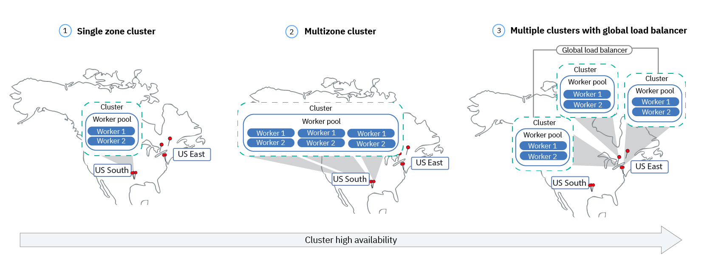

# Lab 2: Escale e Atualize seus Deployments

Neste laboratório, você aprenderá como atualizar o número de instâncias
uma implantação tem e como implementar com segurança uma atualização de seu aplicativo no Kubernetes.

Para este laboratório, você precisa de uma implantação em execução do aplicativo `guestbook` do laboratório anterior. Se você precisar criá-lo, execute:

```shell
kubectl create deployment guestbook --image=ibmcom/guestbook:v1
```

## 1. Escale seus apps com replicas

Uma *replica* é uma cópia de um pod que contém um serviço em execução. Ao ter várias réplicas de um pod, você pode garantir que sua implantação tenha os recursos disponíveis para lidar com o aumento da carga em seu aplicativo.

1. `kubectl` fornece um subcomando` scale` para alterar o tamanho de uma implantação existente. Vamos aumentar nossa capacidade de uma única instância em execução do `guestbook` para até 10 instâncias:

   ```shell
   kubectl scale --replicas=10 deployment guestbook
   ```

   O Kubernetes agora tentará fazer com que a realidade corresponda ao estado desejado de 10 réplicas, iniciando 9 novos pods com a mesma configuração do primeiro.

1. Para ver suas alterações sendo implementadas, você pode executar:
   ```shell
   kubectl rollout status deployment guestbook
   ```

   O rollout pode ocorrer tão rapidamente que as seguintes mensagens podem _não_ ser exibidas:

   ```shell
   $ kubectl rollout status deployment guestbook
   Waiting for rollout to finish: 1 of 10 updated replicas are available...
   Waiting for rollout to finish: 2 of 10 updated replicas are available...
   Waiting for rollout to finish: 3 of 10 updated replicas are available...
   Waiting for rollout to finish: 4 of 10 updated replicas are available...
   Waiting for rollout to finish: 5 of 10 updated replicas are available...
   Waiting for rollout to finish: 6 of 10 updated replicas are available...
   Waiting for rollout to finish: 7 of 10 updated replicas are available...
   Waiting for rollout to finish: 8 of 10 updated replicas are available...
   Waiting for rollout to finish: 9 of 10 updated replicas are available...
   deployment "guestbook" successfully rolled out
   ```

1. Assim que a implementação for concluída, verifique se seus pods estão em execução usando:
   ```shell
   kubectl get pods
   ```

   Você deve ver a saída listando 10 réplicas de sua implantação:

   ```shell
   $ kubectl get pods
   NAME                        READY     STATUS    RESTARTS   AGE
   guestbook-562211614-1tqm7   1/1       Running   0          1d
   guestbook-562211614-1zqn4   1/1       Running   0          2m
   guestbook-562211614-5htdz   1/1       Running   0          2m
   guestbook-562211614-6h04h   1/1       Running   0          2m
   guestbook-562211614-ds9hb   1/1       Running   0          2m
   guestbook-562211614-nb5qp   1/1       Running   0          2m
   guestbook-562211614-vtfp2   1/1       Running   0          2m
   guestbook-562211614-vz5qw   1/1       Running   0          2m
   guestbook-562211614-zksw3   1/1       Running   0          2m
   guestbook-562211614-zsp0j   1/1       Running   0          2m
   ```

**Dica:** Outra maneira de melhorar a disponibilidade é
[adicionar clusters e regiões](https://cloud.ibm.com/docs/containers?topic=containers-ha_clusters#ha_clusters)
para o seu deployment, conforme mostrado no diagrama a seguir:



## 2. Atualização e Rollback no seus apps

O Kubernetes permite que você faça upgrade contínuo do seu aplicativo para uma nova imagem de contêiner. Isso permite que você atualize facilmente a imagem em execução e também desfaça facilmente uma implementação se um problema for descoberto durante ou após a implementação.

No laboratório anterior, usamos uma imagem com uma tag `v1`. Para nossa atualização, usaremos a imagem com a tag `v2`.

Para atualizar e reverter:

1. Usando `kubectl`, agora você pode atualizar sua implantação para usar a imagem` v2`. `kubectl` permite que você altere detalhes sobre os recursos existentes com o subcomando` set`. Podemos usá-lo para alterar a imagem que está sendo usada.

    ```shell
    kubectl set image deployment/guestbook guestbook=ibmcom/guestbook:v2
    ```

   Observe que um pod pode ter vários contêineres, cada um com seu próprio nome. Cada imagem pode ser alterada individualmente ou de uma vez, referindo-se ao nome. No caso de nossa implantação `guestbook`, o nome do contêiner também é` guestbook`. Vários contêineres podem ser atualizados ao mesmo tempo.
   ([Saiba mais](https://kubernetes.io/docs/reference/generated/kubectl/kubectl-commands#-em-image-em-).)

1. Para verificar o status do rollout, execute:

   ```shell
   kubectl rollout status deployment/guestbook
   ```   

   O lançamento pode ocorrer tão rapidamente que as seguintes mensagens podem _não_ ser exibidas:

   ```shell
   $ kubectl rollout status deployment/guestbook
   Waiting for rollout to finish: 2 out of 10 new replicas have been updated...
   Waiting for rollout to finish: 3 out of 10 new replicas have been updated...
   Waiting for rollout to finish: 3 out of 10 new replicas have been updated...
   Waiting for rollout to finish: 3 out of 10 new replicas have been updated...
   Waiting for rollout to finish: 4 out of 10 new replicas have been updated...
   Waiting for rollout to finish: 4 out of 10 new replicas have been updated...
   Waiting for rollout to finish: 4 out of 10 new replicas have been updated...
   Waiting for rollout to finish: 4 out of 10 new replicas have been updated...
   Waiting for rollout to finish: 4 out of 10 new replicas have been updated...
   Waiting for rollout to finish: 5 out of 10 new replicas have been updated...
   Waiting for rollout to finish: 5 out of 10 new replicas have been updated...
   Waiting for rollout to finish: 5 out of 10 new replicas have been updated...
   Waiting for rollout to finish: 6 out of 10 new replicas have been updated...
   Waiting for rollout to finish: 6 out of 10 new replicas have been updated...
   Waiting for rollout to finish: 6 out of 10 new replicas have been updated...
   Waiting for rollout to finish: 7 out of 10 new replicas have been updated...
   Waiting for rollout to finish: 7 out of 10 new replicas have been updated...
   Waiting for rollout to finish: 7 out of 10 new replicas have been updated...
   Waiting for rollout to finish: 7 out of 10 new replicas have been updated...
   Waiting for rollout to finish: 8 out of 10 new replicas have been updated...
   Waiting for rollout to finish: 8 out of 10 new replicas have been updated...
   Waiting for rollout to finish: 8 out of 10 new replicas have been updated...
   Waiting for rollout to finish: 8 out of 10 new replicas have been updated...
   Waiting for rollout to finish: 9 out of 10 new replicas have been updated...
   Waiting for rollout to finish: 9 out of 10 new replicas have been updated...
   Waiting for rollout to finish: 9 out of 10 new replicas have been updated...
   Waiting for rollout to finish: 1 old replicas are pending termination...
   Waiting for rollout to finish: 1 old replicas are pending termination...
   Waiting for rollout to finish: 1 old replicas are pending termination...
   Waiting for rollout to finish: 9 of 10 updated replicas are available...
   Waiting for rollout to finish: 9 of 10 updated replicas are available...
   Waiting for rollout to finish: 9 of 10 updated replicas are available...
   deployment "guestbook" successfully rolled out
   ```

1. Teste o aplicativo como antes, acessando `<public-IP>:<nodeport>`
   no navegador para confirmar se seu novo código está ativo.

   Lembre-se, para obter o "nodeport" e o "public-ip", use os seguintes comandos. Substitua `$CLUSTER_NAME` pelo nome do seu cluster se a variável de ambiente não estiver configurada.

   ```shell
   kubectl describe service guestbook
   ```
   and
   ```shell
   kubectl get nodes -o wide
   ```

   Para verificar se você está executando a "v2" do guestbook, olhe o título da página, agora deve ser `Guestbook - v2`. Se você estiver usando um navegador, certifique-se de forçar a atualização (invalidando o cache).

1. Se você deseja desfazer seu rollout mais recente, use:

   ```shell
   kubectl rollout undo deployment guestbook
   ```

   Você pode então usar este comando para ver o status:
   ```shell
   kubectl rollout status deployment/guestbook
   ``` 

1. Ao fazer uma implementação, você verá referências a réplicas *antigas* e *novas* réplicas.
    As réplicas *antigas* são os 10 pods originais implantados quando escalamos o aplicativo.
    As *novas* réplicas vêm de pods recém-criados com imagens diferentes.
    Todos esses pods são de propriedade da implantação.
    A implantação gerencia esses dois conjuntos de pods com um recurso chamado ReplicaSet.
    Podemos ver o livro de visitas ReplicaSets com:

   ```shell
   $ kubectl get replicasets -l app=guestbook
   NAME                   DESIRED   CURRENT   READY     AGE
   guestbook-5f5548d4f    10        10        10        21m
   guestbook-768cc55c78   0         0         0         3h
   ```

Antes de continuarmos, vamos excluir o aplicativo para que possamos aprender sobre uma maneira diferente de obter os mesmos resultados:

 Para remover o deployment, use
 ```shell
 kubectl delete deployment guestbook
 ```

 Para remover o serviço, use:
 ```shell
 kubectl delete service guestbook
 ```


Parabéns! Você implantou a segunda versão do aplicativo. Lab 2
agora está completo. Continue para o [próximo laboratório](../Lab3/README.md).
