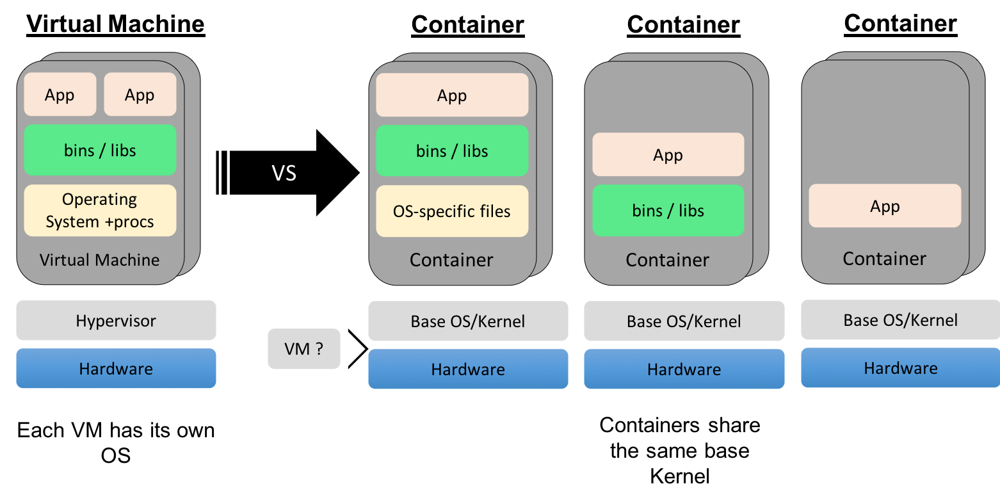
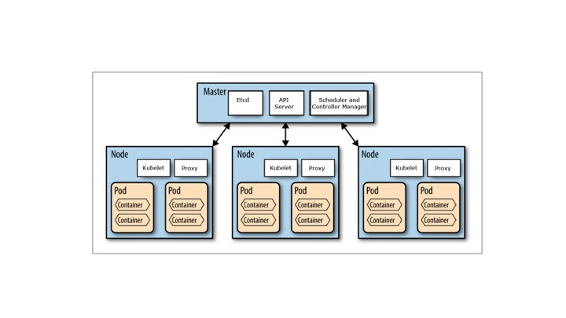

# IBM Cloud Kubernetes Service Lab

# Uma introdução a containers

Ei, você está procurando um curso de containers 101? Confira nosso [Docker Essentials](https://developer.ibm.com/courses/all/docker-essentials-extend-your-apps-with-containers/).

Containers permitem que você execute aplicativos isolados com segurança com cotas nos recursos do sistema. Os contêineres começaram como um recurso individual entregue com o kernel do Linux. O Docker foi lançado tornando os contêineres fáceis de usar e os desenvolvedores rapidamente aderiram a essa ideia. Os contêineres também despertaram o interesse na arquitetura de microsserviços, um padrão de design para o desenvolvimento de aplicativos em que aplicativos complexos são reduzidos em partes menores e composíveis que funcionam juntas.

Veja este vídeo [video](https://www.youtube.com/watch?v=wlBhtc31I8c) para aprender um pouco mais sobre como containers são usados em produção.

# Objetivos

Este laboratório é uma introdução ao uso de contêineres Docker no Kubernetes no IBM Cloud Kubernetes Service. Ao final do curso, você alcançará estes objetivos:
* Entenda os principais conceitos do Kubernetes
* Construir uma imagem Docker e implantar um aplicativo no Kubernetes no IBM Cloud Kubernetes Service
* Controle as implantações de aplicativos, enquanto minimiza seu tempo com gerenciamento de infraestrutura
* Adicione serviços de IA para estender seu aplicativo
* Proteja e monitore seu cluster e aplicativo

# Pré-requisitos 
* Uma conta Pay-As-You-Go ou faça sua conta em [IBM Cloud account](https://console.bluemix.net/registration/)

# Máquinas Virtuais

Antes dos containers, a maioria da infraestrutura não era executada em bare metal, mas sobre hyper-visors gerenciando vários sistemas operacionais virtualizados (SOs). Esse arranjo permitiu o isolamento de aplicativos uns dos outros em um nível mais alto do que o fornecido pelo sistema operacional. Esses sistemas operacionais virtualizados veem o que parece ser seu próprio hardware exclusivo. No entanto, isso também significa que cada um desses sistemas operacionais virtuais está replicando um sistema operacional inteiro, ocupando espaço em disco.

# Containers

Os containers fornecem isolamento semelhante às VMs, exceto pelo sistema operacional e no nível do processo. Cada contêiner é um processo ou grupo de processos executados isoladamente. Os containers típicos executam explicitamente apenas um único processo, pois não precisam dos serviços padrão do sistema. O que eles geralmente precisam fazer pode ser fornecido por chamadas de sistema ao kernel do sistema operacional de base.

O isolamento no Linux é fornecido por um recurso chamado 'namespaces'. Cada tipo diferente de isolamento (usuário do IE, cgroups) é fornecido por um namespace diferente.

Esta é uma lista de alguns dos namespaces comumente usados e visíveis para o usuário:

* PID - ID do processo
* USER - ID dos usuarios ou grupos
* UTS - hostname e domain name
* NS - mount points
* NET - dispositivos de rede, pilhas e portas
* CGROUPS - controle de limites e monitoramento de recursos

# VM vs container

Os aplicativos tradicionais são executados em hardware nativo. Um único aplicativo normalmente não usa todos os recursos de uma única máquina. Tentamos executar vários aplicativos em uma única máquina para evitar o desperdício de recursos. Poderíamos executar várias cópias do mesmo aplicativo, mas para fornecer isolamento, usamos VMs para executar várias instâncias de aplicativo (VMs) no mesmo hardware. Essas VMs têm pilhas de sistema operacional completas, o que as torna relativamente grandes e ineficientes devido à duplicação no tempo de execução e no disco.

Containers permitem que você compartilhe o sistema operacional host. Isso reduz a duplicação e, ao mesmo tempo, fornece isolamento. Containers também permitem que você descarte arquivos desnecessários, como bibliotecas e binários do sistema, para economizar espaço e reduzir a superfície de ataque. Se SSHD ou LIBC não estiverem instalados, eles não podem ser explorados.

# Prepare-se

Antes de mergulharmos no Kubernetes, você precisa provisionar um cluster para seu aplicativo em container. Então, você não terá que esperar que ele esteja pronto para os laboratórios subsequentes.

1. Você deve instalar os CLIs por https://console.ng.bluemix.net/docs/containers/cs_cli_install.html. Se você ainda não tem essas CLIs e a CLI do Kubernetes, faça o [lab 0](Lab0) antes de iniciar o curso.
2. Se ainda não o fez, provisione um cluster. Isso pode levar alguns minutos, portanto, comece primeiro: `ibmcloud ks cluster-create --name <name-of-cluster>`
3. Após a criação, antes de usar o cluster, verifique se ele concluiu o provisionamento e está pronto para uso. Execute ʻibmcloud cs clusters` e certifique-se de que seu cluster está no estado "deployed".
4. Em seguida, use `ibmcloud ks workers <name-of-cluster>`e certifique-se de que todos os nós de trabalho estejam no estado "normal" com Status "Ready".

# Kubernetes e containers: Um overview

Vamos falar sobre a orquestração do Kubernetes para containers antes de criar um aplicativo nele. Precisamos entender os seguintes fatos sobre isso:

* O que é Kubernetes?
* Como o Kubernetes foi criado?
* Arquitetura do Kubernetes
* Modelo de recursos do Kubernetes
* Kubernetes na IBM

# O que é Kubernetes?

Agora que sabemos o que são containers, vamos definir o que é Kubernetes. O Kubernetes é um orquestrador de containers para provisionar, gerenciar e dimensionar aplicativos. Em outras palavras, o Kubernetes permite que você gerencie o ciclo de vida de aplicativos em containers em um cluster de nós (que são uma coleção de máquinas de trabalho, por exemplo, VMs, máquinas físicas etc.).

Seus aplicativos podem precisar de muitos outros recursos para serem executados, como Volumes, Redes e Secrets, que o ajudarão a fazer coisas como conectar-se a bancos de dados, conversar com back-ends protegidos por firewall e chaves seguras. O Kubernetes ajuda você a adicionar esses recursos ao seu aplicativo. Os recursos de infraestrutura necessários aos aplicativos são gerenciados declarativamente.

**Curiosidade:** Outras tecnologias de orquestração são Mesos e Swarm.

O paradigma chave do kubernetes é seu modelo declarativo. O usuário fornece o "estado desejado" e o Kubernetes fará o melhor para que isso aconteça. Se precisar de 5 instâncias, não inicie 5 instâncias separadas por conta própria, mas diga ao Kubernetes que precisa de 5 instâncias e o Kubernetes reconciliará o estado automaticamente. Simplesmente neste ponto, você precisa saber que declara o estado que deseja e o Kubernetes faz isso acontecer. Se algo der errado com uma das suas instâncias e ela falhar, o Kubernetes ainda saberá o estado desejado e criará novas instâncias em um nó disponível.

**Cultura inútil:** O Kubernetes tem muitos nomes. Às vezes é abreviado para _k8s_ (perdendo as 8 letras internas) ou _kube_. A palavra tem origem no grego antigo e significa "timoneiro". Um timoneiro é a pessoa que dirige um navio. Esperamos que você possa ver a analogia entre dirigir um navio e as decisões tomadas para orquestrar contêineres em um cluster.

# Como o Kubernetes foi criado?

O Google queria abrir o código de seu conhecimento de criação e execução de ferramentas internas Borg e Omega. Ela adotou o Open Governance para Kubernetes iniciando a Cloud Native Computing Foundation (CNCF) e dando o Kubernetes a essa fundação, tornando-o menos influenciado diretamente pelo Google. Muitas empresas como RedHat, Microsoft, IBM e Amazon rapidamente se juntaram à fundação.

O principal ponto de entrada para o projeto kubernetes é em [http://kubernetes.io](http://kubernetes.io) e o código-fonte pode ser encontrado em [https://github.com/kubernetes](https://github.com/kubernetes).

# Arquitetura do Kubernetes

Basicamente, o Kubernetes é um armazenamento de dados (etcd). O modelo declarativo é armazenado no armazenamento de dados como objetos, o que significa que quando você diz que quero 5 instâncias de um contêiner, essa solicitação é armazenada no armazenamento de dados. Esta mudança de informação é observada e delegada aos Controladores para agirem. Os controladores então reagem ao modelo e tentam realizar uma ação para atingir o estado desejado. O poder do Kubernetes está em seu modelo simplista.

Conforme mostrado, o servidor API é um servidor HTTP simples que lida com operações de criação / leitura / atualização / exclusão (CRUD) no armazenamento de dados. Em seguida, o controlador seleciona a mudança que você deseja e a faz acontecer. Os controladores são responsáveis por instanciar o recurso real representado por qualquer recurso do Kubernetes. Esses recursos reais são o que seu aplicativo precisa para permitir que ele seja executado com êxito.

# Modelo de recursos do Kubernetes

A infraestrutura do Kubernetes define um recurso para cada finalidade. Cada recurso é monitorado e processado por um controller. Quando você define seu aplicativo, ele contém uma coleção desses recursos. Esta coleção será então lida por Controllers para construir instâncias de apoio reais de seus aplicativos. Alguns dos recursos com os quais você pode trabalhar estão listados abaixo para sua referência, para uma lista completa, você deve ir para [https://kubernetes.io/docs/concepts/](https://kubernetes.io/docs/concepts/) Nesta aula, usaremos apenas alguns deles, como Pod, Deployment, etc.

* Config Maps contém dados de configuração para os pods consumirem.
* Daemon Sets garantem que cada nó no cluster execute este pod
* Deployments define um estado desejado de um objeto de implantação
* Events fornece eventos de ciclo de vida em pods e outros objetos de implantação
* Endpoints permite conexões de entrada para alcançar os serviços de cluster
* Ingress é um conjunto de regras que permite que conexões de entrada alcancem os serviços de cluster
* Jobs cria um ou mais pods e, à medida que são concluídos com êxito, o @job é marcado como concluído.
* Node é uma máquina de trabalho no Kubernetes
* Namespaces são vários clusters virtuais apoiados pelo mesmo cluster físico
* Pods são as menores unidades de computação implantáveis ​​que podem ser criadas e gerenciadas no Kubernetes
* Persistent @Volumes fornece uma API para usuários e administradores que abstrai detalhes de como o armazenamento é fornecido e como é consumido
* Replica Sets garante que um número especificado de réplicas de pod estejam em execução a qualquer momento
* Secrets destinam-se a conter informações confidenciais, como senhas, tokens OAuth e chaves ssh
* Service Accounts fornece uma identidade para processos executados em um pod
* Services é uma abstração que define um conjunto lógico de pods e uma política para acessá-los - às vezes chamado de micro-serviço.
* Stateful Sets é o objeto API de carga de trabalho usado para gerenciar aplicativos com estado.
* e mais...

O Kubernetes não tem o conceito de aplicativo. Possui blocos de construção simples que você deve compor. O Kubernetes é uma plataforma nativa em nuvem em que o modelo de recursos interno é igual ao modelo de recursos do usuário final.

# Recursos chave

Um pod é o menor modelo de objeto que você pode criar e executar. Você pode adicionar rótulos a um pod para identificar um subconjunto no qual executar operações. Quando estiver pronto para dimensionar seu aplicativo, você pode usar o rótulo para informar ao Kubernetes qual pod você precisa dimensionar. Um pod normalmente representa um processo em seu cluster. Os pods contêm pelo menos um contêiner que executa o trabalho e, além disso, podem ter outros contêineres chamados de sidecars para monitoramento, registro, etc. Basicamente, um pod é um grupo de contêineres.

Quando falamos sobre um aplicativo, geralmente nos referimos a um grupo de pods. Embora um aplicativo inteiro possa ser executado em um único pod, geralmente construímos vários pods que se comunicam para criar um aplicativo útil. Veremos por que separar a lógica do aplicativo e o banco de dados de back-end em pods separados será melhor escalonado quando construirmos um aplicativo em breve.

Os serviços definem como expor seu aplicativo como uma entrada DNS para ter uma referência estável. Usamos o seletor baseado em consulta para escolher quais pods estão fornecendo esse serviço.

O usuário manipula recursos diretamente via yaml:
`$ kubectl (create|get|apply|delete) -f myResource.yaml`

O Kubernetes nos fornece uma interface de cliente por meio de ‘kubectl’. Os comandos Kubectl permitem que você gerencie seus aplicativos, gerencie cluster e recursos de cluster, modificando o modelo no armazenamento de dados.

# Workflow de deployment de aplicação com Kubernetes

1. O usuário via "kubectl" implanta um novo aplicativo. Kubectl envia a solicitação ao servidor da API.
2. O servidor API recebe a solicitação e a armazena no armazenamento de dados (etcd). Depois que a solicitação é gravada no armazenamento de dados, o servidor API termina com a solicitação.
3. Os observadores detectam as mudanças de recursos e enviam uma notificação ao controlador para agir de acordo
4. O Controller detecta o novo aplicativo e cria novos pods para corresponder ao número desejado de instâncias. Quaisquer alterações no modelo armazenado serão selecionadas para criar ou excluir pods.
5. O Scheduler atribui novos pods a um Node com base em um critério. O Scheduler toma decisões para executar pods em nós específicos no cluster. O Scheduler modifica o modelo com as informações do nó.
6. O Kubelet em um nó detecta um pod com uma atribuição para si mesmo e implanta os contêineres solicitados por meio do tempo de execução do container (por exemplo, Docker). Cada nó observa o armazenamento para ver quais pods estão designados para executar. Ele executa as ações necessárias no recurso atribuído a ele, como criar / excluir pods.
7. O Kubeproxy gerencia o tráfego de rede para os pods - incluindo descoberta de serviço e balanceamento de carga. O Kubeproxy é responsável pela comunicação entre os pods que desejam interagir.

# Informações adicionais sobre o lab

IBM Cloud fornece a capacidade de executar aplicativos em contêineres no Kubernetes. O IBM Cloud Kubernetes Service executa clusters Kubernetes que oferecem o seguinte:

* Ferramentas poderosas
* Experiência do usuário intuitiva
* Segurança e isolamento integrados para permitir a entrega rápida de aplicativos seguros
* Serviços em nuvem, incluindo recursos cognitivos do Watson
* Capacidade de gerenciar recursos de cluster dedicados para aplicativos sem estado e cargas de trabalho com estado

#  Lab overview

[Lab 0](Lab0): Fornece um passo a passo para instalar ferramentas de linha de comando do IBM Cloud e a CLI do Kubernetes. Você pode pular este laboratório se tiver o IBM Cloud CLI, o plug-in de serviço de contêiner, o plug-in de registro de contêineres e o CLI de kubectl já instalados em sua máquina.

[Lab 1](Lab1): Este laboratório explica como criar e implantar um aplicativo "guestbook" simples escrito em Go como um servidor net/http e como acessá-lo.

[Lab 2](Lab2): Baseia-se no laboratório 1 para expandir para uma configuração mais resiliente que pode sobreviver a falhas e recuperação de contêineres. O Laboratório 2 também percorrerá os serviços básicos necessários para começar a usar o Kubernetes e o IBM Cloud Kubernetes Service

[Lab 3](Lab3): Baseia-se no laboratório 2, aumentando os recursos do aplicativo Guestbook implantado. Este laboratório cobre o design básico de aplicativos distribuídos e como o kubernetes ajuda a usar as práticas de design padrão.

<!-- [Lab D](LabD): Dicas e truques de depuração para ajudá-lo na jornada do Kubernetes. Este laboratório é uma referência útil que não segue uma sequência específica dos outros laboratórios. -->
